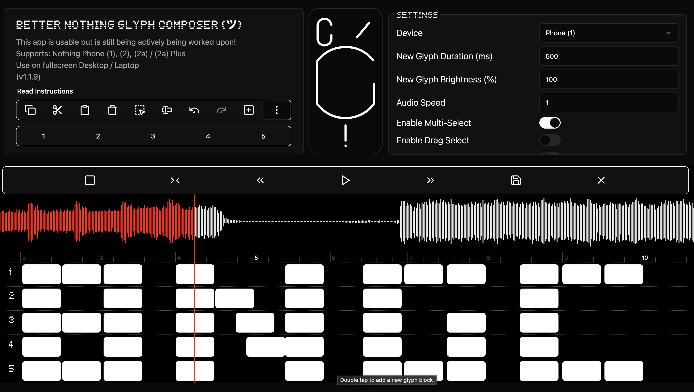

# 🌟 Better Nothing Glyph Composer (ツ)

Bring your Nothing Phone's tones to life with light and sound! This side project is my attempt to add a fun and creative twist to my Nothing Phone (1) experience. As an already overworked developer, I put this together in my spare time, so any help is greatly appreciated. With this app, you can craft custom ringtones from your favorite audio files and synchronize them with the light patterns on the back of your Nothing phone, known as "Glyphs".

## 👾 Demo

Screenshot:

Videos:

https://github.com/user-attachments/assets/c1c50cbe-a1ae-49be-8d99-273252b56eb7

https://github.com/user-attachments/assets/c75d99f3-87ec-4478-bbb7-96d15cb12880

https://github.com/user-attachments/assets/0dbcb302-aa48-467d-81e9-e0b2097639b0

## 🚀 Features

- **Load Audio Files**: Import your favorite `.mp3` or `.ogg` files to start creating.
- **Media Controls**: Easily play, pause, stop, and seek through your audio tracks.
- **Glyph Editing**: Customize Glyphs with an intuitive editor that feels like a professional timeline tool.
- **Interactive Glyph Blocks**:
  - Add as many glyph blocks as you'd like
  - Don't like a glyph block? Delete it.
  - Drag to move a block around
  - Select to Trim and adjust
  - Keyboard gestures like spacebar to play/pause
  - Auto Generate Glyph effects
  - Generate Glyph Blocks on basis of custom parameters
  - ...and tons more
- **Visual Navigation**: Scroll to explore your glyph edits on track effortlessly.
- **Tip**: Hovering over elements for a while will show a helpful pop up with tips in most cases!

## 🎨 How to Use (Instructions)

1. **Load Your Audio**:

   - Start by loading your audio file (supports `.mp3` and `.ogg` formats).

2. **Edit Glyphs**:

   - **Double tap** on the track to add a Glyph block.
   - **Right click** on a block to delete it.
   - **Drag** from the left side to move, or from the right to resize.
   - **Select** and select right trim handle to trim and adjust
   - **Scroll** right and left (x-axis) to explore your track effortlessly.

3. **Save Your Creation**:

   - Click the save icon (floppy disk), rename your file (make sure it ends with `.ogg`), and save it.

4. **Apply Your Ringtone**:
   - Open the official Composer app from Nothing.
   - Go to 'Library' via the 3-dash icon (make sure you have existing recordings for the icon to appear).
   - Use the top-right 3-dot menu to import your saved file.
   - Scroll to the top of 'Library' if you can’t find your file, preview it, and set it as your default ringtone.

## 📜 Early Release Notes

- **Stay Humorous**: Remember, this is an early version, so let's keep a light-hearted approach while using it! 😄
- **More Demo & Discussion**: Available on this forum on [Nothing's official discord server channel](https://discord.com/channels/930878214237200394/1275717674634051661)

## 📫 Contributing

Contributions are welcomed! Feel free to open issues or submit pull requests.

## 🙌 Credits 
- Special thanks to the amazing contributors behind [custom-nothing-glyph-tools](https://github.com/SebiAi/custom-nothing-glyph-tools)! For their comprehensive technical documentation. It guided me through the process and demystified the magic behind Nothing Glyphs! 🚀 
- A huge thank you to SebiAi (creator of the above) for generously dedicating time to checkout and test my project. His feedback and support were invaluable! 🙏🎉

## 📄 License

This project is licensed under the GNU General Public License v3.0.

---

Happy Composing! 🎵✨ 
Disclaimer: I am not affiliated with Nothing. This is just a personal hobby project.

---

_Made with ❤️ by Krishnagopal Sinha_

## 🤝 Donation Links

## TODO:

-[X] Exit confirmation feat. as while sliding on laptop one may trigger back gesture 

-[ ] Read glyph data from input ogg files

-[ ] Solve existing github issues

-[X] Add various effect feature

-[X] Snap to grid feature added, with BPM support and stuff!

-[X] Custom Rom Glyph Data Export

-[ ] Fix Timeline preview in composer or make it empty ish or somthing?

-[ ] UI Refresh :eyes:

-[ ] Add visualizer or would that just slow the website down ?
